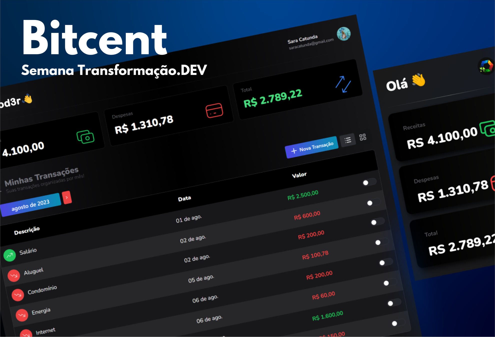

<h1 align="center">Bitcent (Aplicação Financeira!)</h1>


 

# Tópicos
  * [Sobre o Projeto](#Sobre)
  * [Tecnologias](#Tecnologias)
  * [Demonstração](#Demonstração)
  * [Instalação](#Instalação)


# Sobre o Projeto
Bitcent é uma aplicação web para controle de finanças pessoais com landing page e dashboard. O projeto utiliza o Firebase para autenticação e armazenamento de dados.
Projeto foi desenvolvido durante a [Semana Tranformação.DEV,](https://www.instagram.com/cod3rcursos) que ocorreu nos dias 8 a 12 de Maio de 2023.

# Tecnologias
Lista de tecnologias utilizadas no projeto:

[React](https://react.dev/)<br>
[Next.js](https://nextjs.org/)<br>
[Firebase](https://firebase.google.com/?hl=pt-br)<br>
[TypeScript](https://www.typescriptlang.org/)<br>
[TailwindCSS](https://tailwindcss.com/)<br>
[Mantine](https://mantine.dev/)<br>

# Demonstração
[Link](https://bitcent-2lzh-e4jwcyme4-thiago-cardoso-de-vasconcelos.vercel.app/)

Resultado:
<p align="center">
  
</p>

# Instalação
Clone o repositório:

```
$ git clone https://github.com/transformacaodev/bitcent
$ cd bitcent
```

Crie um projeto no Firebase e ative o Firestore e Autenticação com Google.
Permissões do Firestore:

```
rules_version = '2';
service cloud.firestore {
  match /databases/{database}/documents {
    match /{document=**} {
    	allow read, write: if false;
    }

    match /financas/{email}/transacoes/{id} {
  		allow read: if (request.auth != null && request.auth.token.email == email);
      allow write: if (request.auth != null && request.auth.token.email == email);
    }
    
    match /usuarios/{email} {
  		allow read: if (request.auth != null && request.auth.token.email == email);
      allow write: if (request.auth != null && request.auth.token.email == email);
    }
  }
}
```

É preciso criar um arquivo .env.local na raiz do projeto com as seguintes variáveis:

```
NEXT_PUBLIC_FIREBASE_PROJECT_ID=
NEXT_PUBLIC_FIREBASE_AUTH_DOMAIN=
NEXT_PUBLIC_FIREBASE_API_KEY=
```
Usar as credenciais do seu projeto no Firebase.

Dentro da pasta do projeto, execute os comandos abaixo:
```
# Instalar as dependências
$ npm install
```

# Iniciar o projeto
```
$ npm run dev
```
O app estará disponível no endereço http://localhost:3000.


